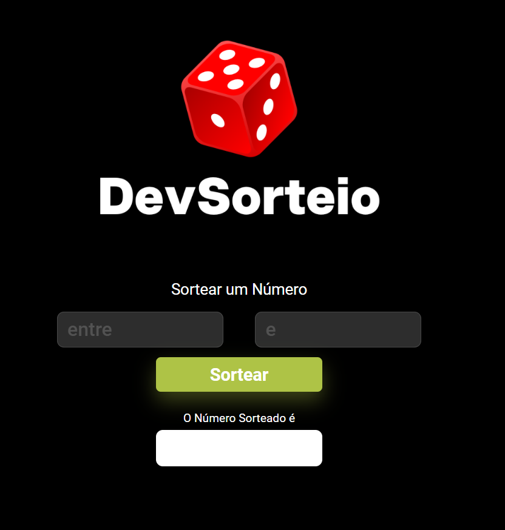

### Descrição
Este projeto consiste em uma página web simples que permite ao usuário sortear um número aleatório dentro de um intervalo definido por ele. A aplicação é construída utilizando HTML, CSS e JavaScript básico.

### Utilização
Para utilizar esta aplicação, basta seguir os passos abaixo:

1. **Acesso à Página:** Abra o arquivo `index.html` em um navegador web.
2. **Inserir Intervalo:** Preencha os campos de entrada com o valor mínimo e máximo desejados para o sorteio.
3. **Sortear Número:** Clique no botão "Sortear" para gerar um número aleatório dentro do intervalo especificado.
4. **Resultado:** O número sorteado será exibido logo abaixo do botão "Sortear".

### Exemplo de Uso
Suponha que você queira sortear um número entre 1 e 100:

- Insira `1` no campo de entrada "entre" (`input-min`).
- Insira `100` no campo de entrada "e" (`input-max`).
- Clique no botão "Sortear".
- O número sorteado será exibido no campo de resultado.

### Como Clonar na Máquina
Para clonar este projeto em sua máquina local, siga os passos abaixo:

1. Abra o terminal.
2. Navegue até o diretório onde deseja armazenar o projeto.
3. Execute o seguinte comando para clonar o repositório:
   ```bash
   git clone https://github.com/gustavomansurr/drawn-number.git
Após clonar, você pode abrir o arquivo index.html em um navegador para utilizar a aplicação.